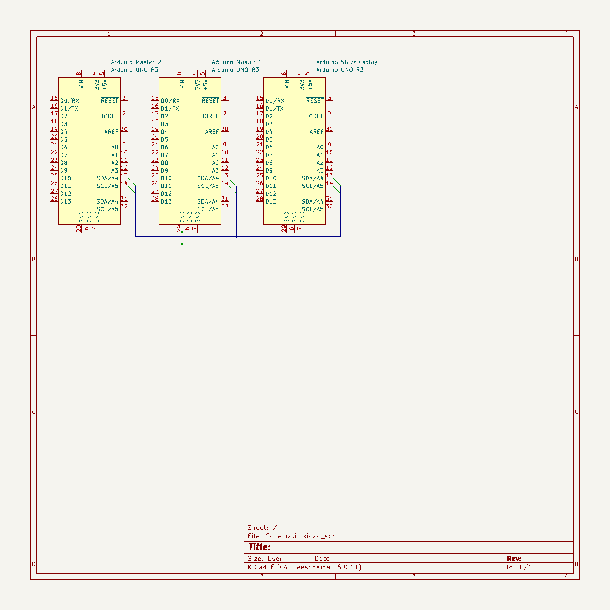

# Communication - I2C

The aim of this project is to create a multi-master I2C bus, with which I can  transmit data from the masters to the display. The system must contain 2 master devices and 1 slave, being the sensors and display.

For the purposes of this project, I'll be implementing two DHT11 sensors, and an OLED display. The DHT11 sensors will be used to measure temperature and humidity, and the OLED display will be used to display the data.

## Concepts

### Hardware based solution

While this does not adhere to the I2C specification, it is a simple solution to the problem. The hardware based solution is based on using GPIO pins to force control of the bus, by directly controlling another master. Due to the requirements of the project, this solution is not applicable.

### Token based solution (AKA Token Passing Media Access Control)

An access token is passed in a regular pattern between devices. This token is used to determine which device has control of the bus. The token is passed from device to device, until it reaches the device that wants to take control of the bus. The device that wants control of the bus waits for availability of the token, and then takes control of the bus. The device then performs the required actions, and passes the token to the next device. This goes on until the system shuts down. In pseudocode, this would look like the following:

``` md
Loop forever
{
    Wait for token
    Take control of the bus
    Verify I have control of the bus
    If I have control of the bus
    {
        Do something
    }
    Relinquish control of the bus
    Pass token to next device
}
```

### Register based control

With this concept, the goal of either master is to take control of the bus by writing to the control register. The control register is a 1 byte register, which is located at address 0x00. The control register is used to set the state of the bus. The following states are possible:

| Value | Description |
|-------|-------------|
| 0x00  | Bus free    |
| 0x01  | Master 1    |
| 0x02  | Master 2    |

The control register is read by all masters. If a master wants to take control of the bus, it writes to the control register. If the bus is free, the master takes control of the bus. If the bus is taken by another master, the master waits until the bus is free. If the bus is taken by itself, the master does nothing.

``` md
Loop Forever
{
  Check Internal Register
  if BusTaken
}
```

### Feedback

After speaking to Felix, a few things were clarified. While I was initially under the impression that I needed to implement my own low level arbitration, this is not the case, as the Wire Library for Arduino already has an implementation for this. The purpose was to implement a system for dictating masters on the I2C bus.

After a brief discussion of options, we decided that the best option would be to use a register based system. This would allow for the system to be easily expanded, and would allow for the system to be easily debugged.

## Detecting Bus Arbitration

<!-- TODO: Explain the interrupt shenanigans I found  -->

<!-- Timeout go brrr -->

```cpp
case TW_SR_ARB_LOST_SLA_ACK:   // lost arbitration, returned ack
    case TW_SR_ARB_LOST_GCALL_ACK: // lost arbitration, returned ack
      // enter slave receiver mode
      twi_state = TWI_SRX;
      // indicate that rx buffer can be overwritten and ack
      twi_rxBufferIndex = 0;
      twi_reply(1);
      break;
```

```cpp
   case TW_MT_ARB_LOST: // lost bus arbitration
      twi_error = TW_MT_ARB_LOST;
      twi_releaseBus();
      break;
```

```cpp
 case TW_ST_ARB_LOST_SLA_ACK: // arbitration lost, returned ack
      // enter slave transmitter mode
      twi_state = TWI_STX;
      // ready the tx buffer index for iteration
      twi_txBufferIndex = 0;
      // set tx buffer length to be zero, to verify if user changes it
      twi_txBufferLength = 0;
      // request for txBuffer to be filled and length to be set
      // note: user must call twi_transmit(bytes, length) to do this
      twi_onSlaveTransmit();
      // if they didn't change buffer & length, initialize it
      if(0 == twi_txBufferLength){
        twi_txBufferLength = 1;
        twi_txBuffer[0] = 0x00;
      }
      __attribute__ ((fallthrough));		  
      // transmit first byte from buffer, fall
    case TW_ST_DATA_ACK: // byte sent, ack returned
      // copy data to output register
      TWDR = twi_txBuffer[twi_txBufferIndex++];
      // if there is more to send, ack, otherwise nack
      if(twi_txBufferIndex < twi_txBufferLength){
        twi_reply(1);
      }else{
        twi_reply(0);
      }
      break;
```

## Implementation

### Device Addresses

| Device | Address |
|--------|---------|
| Temperature | 0x01 |
| Humidity | 0x02 |
| Display-Arduino | 0x03 |
| OLED Display | 0x060 |
_The OLED display has it's own built in address_

#### Hardware

| Quantity | Device | Description |
|-------------|--------|-------------|
| 3 | Arduino Uno | User for the Master and Slave devices |
| 2 | DHT11 | Used for temperature and humidity sensing |
| 1 | OLED Display | Used for displaying the data |



Not featured is the display, although this is connected to the slave arduino via the proprietary QWIIC connector, used by Sparkfun.

## Display

To make my life easier, I have made a function for printing lines to the display. This function will automatically increment the cursor, so that the next line will be printed below the previous line. This function also automatically displays the data, so that the user does not have to call the display function. The function is as follows:

```cpp

int cursorY = 0;

void PrintLine(String title, int data)
{
  oled.print(title);
  oled.print(data);
  oled.display();
  cursorY += 16;
  oled.setCursor(0,cursorY);
}

void ResetCursor()
{
  oled.setCursor(0,0);
  cursorY = 0;
}

```

This in turn, allows me to simply loop through the data, and print it to the display. The code for this is as follows:

```cpp

void loop()
{
    PrintLine("Temp: ", temp);
    PrintLine("Hum: ", hum);

    oled.clear(PAGE);
    delay(DELAY); // Delay to prevent flooding the bus, 
}

```

### Recieving I2C

To recieve data from the I2C bus, I have created a function that is called when data is recieved. This function will read the data, and then store it in a register. The function is as follows:

```cpp
void onRecieve(int bytes)
{
  int inbound = Wire.read();
  if(incomingData == I2CData::None) // Recieve Register
  {
    incomingData = (I2CData)inbound;
  }
  else // Recieve Data
  {
    switch(incomingData)
    {
      case I2CData::Temperature:
        Temperature = inbound;
        break;
      case I2CData::Humidity:
        Humidity = inbound;
        break;
    }
    incomingData = I2CData::None;
  }
}
```

By always sending two integers, we can denote what the data is. This is done by sending the first integer, indicating what register the data must go to, and the second integer as the data.

```cpp
enum I2CData
{
  None = -1,
  Temperature = 0,
  Humidity = 1
};
```

### Sending I2C

To send the data, I have created a function that will send the data to the display. This function is as follows:

```cpp
void SendData(int data)
{
  Wire.beginTransmission(0x03);
  Wire.write(data);
  Wire.endTransmission();
}
```

This function will send the data to the display, and then end the transmission. This will allow the display to recieve the data, and then display it.

To use this, I'll call the function twice. While I could have used two writes in the same transmission, I decided against this, as it would make the code more difficult to read.

#### Side note

During the Proftaak, I found myself struggling with the ESP32. As it turns out, the Wire library for the ESP32 is not the same as the Wire library for the arduino. The ESP32 Library does not implement the ability to log onto the bus as a master with an address. This causes the wierd situation of being forced to log off, log on without an address, write the data and then finally logging back on as a slave.

## Sensor Devices

### Register

Due to the lack of data that needs to be sent from one master to another, the register is very simple.

| Register | Description |
|----------|-------------|
| 0x01 | Control Register |

While I could simply enact that any data sent to the device is an indication that the other wants control of the bus, I will be using a register based system.

### Checking for Control

The act of checking for control is fairly simple. If the internal register is set, the other device has control of the bus. Else, the device has control of the bus.

### Taking Control

The act of taking control of the bus is slightly more complex however. The device must first check if the bus is free. If it is, the device will then send two bytes of data to the other master. The first being the register it intends to write to, the second being the data. After doing this, the device will then wait for the other master to relinquish control of the bus.

<!-- TODO: Both masters attempt to write -->

### Relinquishing Control

The act of relinquishing control of the bus is fairly simple. The device will simply set the internal register to 0x00, indicating that it no longer has control of the bus.

### Testing

I intend to stress test the system by having it run overnight, and then checking the data in the morning. If the data still updates frequently, I will consider this a success.

## Conclusion

## References
 
<!-- Stuff goes here  -->
