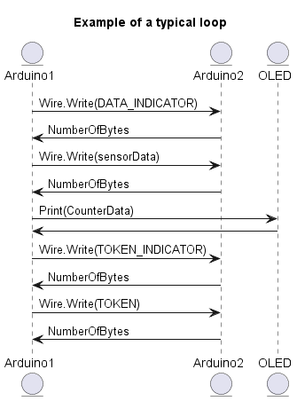
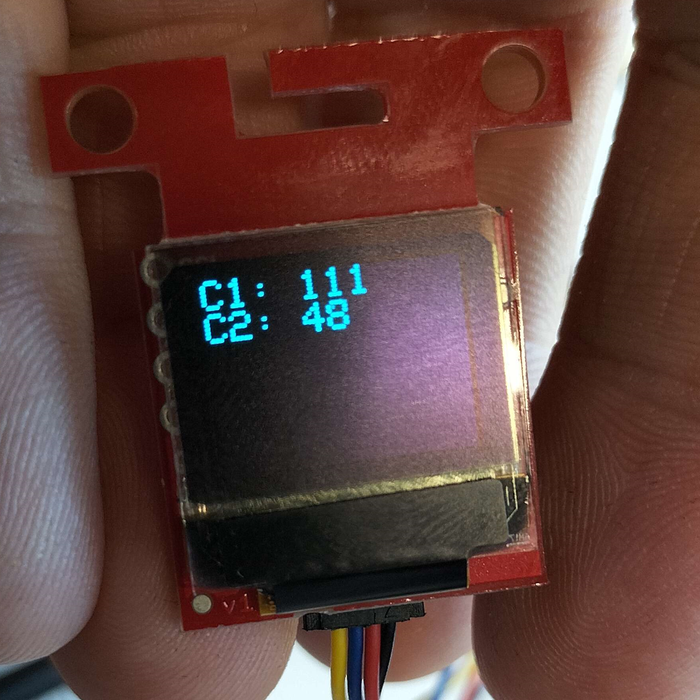

# Communication - I2C

The aim of this project is to create a multi-master I2C bus, with which I can  transmit data from the masters to the display. The system must contain 2 master devices and 1 slave, being the sensors and display.

For the purposes of this project, I'll be implementing a simple counter, which will be incremented everytime the devices recieves control of the bus.

## Token based solution

An access token is passed in a regular pattern between devices. This token is used to determine which device has control of the bus. The token is passed between devices, and when a device has the token, it can transmit data. This is a simple solution, and is fairly easy to implement. Below is some pseudocode for reference:

``` md
Loop forever
{
    Wait for token
    Take control of the bus
    If I have control of the bus
    {
        Do something
    }
    Relinquish control of the bus
    Pass token to next device
}
```

\pagebreak

## Bus Arbitration

### Hardware Bus Arbitration

The I2C bus uses a hardware based arbitration system. This is implemented using the SDA and SCL lines. The SDA line is used to transmit data, and the SCL line is used to transmit the clock. The SDA line is monitored by all devices on the bus. If a device is transmitting a 1, and another device is transmitting a 0, the device transmitting a 0 will detect a 1 on the SDA line, and will stop transmitting. This is how the bus arbitration is implemented.


### Wire Library

The Arduino Wire Library has it's own implementation of bus arbitration. This is implemented in the `twi.c` file. The following is a list of the states that the bus can be in:

```cpp
   case TW_MT_ARB_LOST: // lost bus arbitration
      twi_error = TW_MT_ARB_LOST;
      twi_releaseBus();
      break;
```

In the case that the Master Transmitter (Indicated my `_MT_`) loses the bus arbitration (Indicated by `_ARB_LOST_`), the bus is released. This is done by calling the `twi_releaseBus()` function. This releases the bus then sets itself to an idle state, as seen below.

\pagebreak

```cpp
void twi_releaseBus(void)
{
  // release bus
  TWCR = _BV(TWEN) | _BV(TWIE) | _BV(TWEA) | _BV(TWINT);

  // update twi state
  twi_state = TWI_READY;
}
```

```cpp
 case TW_ST_ARB_LOST_SLA_ACK: // arbitration lost, returned ack
      // enter slave transmitter mode
      twi_state = TWI_STX;
      // ready the tx buffer index for iteration
      twi_txBufferIndex = 0;
      // set tx buffer length to be zero, to verify if user changes it
      twi_txBufferLength = 0;
      // request for txBuffer to be filled and length to be set
      // note: user must call twi_transmit(bytes, length) to do this
      twi_onSlaveTransmit();
      // if they didn't change buffer & length, initialize it
      if(0 == twi_txBufferLength){
        twi_txBufferLength = 1;
        twi_txBuffer[0] = 0x00;
      }
      __attribute__ ((fallthrough));
      // transmit first byte from buffer, fall
    case TW_ST_DATA_ACK: // byte sent, ack returned
      // copy data to output register
      TWDR = twi_txBuffer[twi_txBufferIndex++];
      // if there is more to send, ack, otherwise nack
      if(twi_txBufferIndex < twi_txBufferLength){
        twi_reply(1);
      }else{
        twi_reply(0);
      }
      break;
```

This section of code is responsible for when the Slave Transmitter (as indicated by `_ST_`) loses the arbitration, but does recieve an ACK. It then enters the Slave Transmitter mode, and sets the buffer index to 0. It then calls the `twi_onSlaveTransmit()` function, which is a callback function that is called when the slave is ready to transmit. This function is defined in the `Wire.h` file, and is used to set the buffer length and buffer. If the buffer length is 0, it sets the buffer length to 1, and sets the buffer to 0x00. It then falls through to the `TW_ST_DATA_ACK` case, which is responsible for sending the data. It copies the data to the output register, and then checks if there is more data to send. If there is more data to send, it sends an ACK, otherwise it sends a NACK.
\pagebreak

### Message Protocol


|| In Code | Description |
|--- | --- | --- |
|Indicator Token | T | Token |
|Indicator Data | D | Data |

The message protocol is fairly simple. The master will first send a singular byte, which is the indicator for the type of data. The slave device will read and store the last recieved indicator. The master then writes the data to the bus, and the slave reads the data. The slave then uses the indicator to determine what data was recieved.

### Recieving I2C

To recieve data from the I2C bus, I have created a function that is called when data is recieved. This function will read the data, and then store it in a register.

```cpp
void onRecieve(int howMany)
{
  int inbound = 0;

  if(messageCounter == 0)
  {
    index = (char)Wire.read();
    messageCounter++;
  }
  else
  {
    if(index == TOKEN_INDICATOR)
    {
      inbound = Wire.read();
      if(inbound == TOKEN)
      {
        hasToken = true;
      }
    }
    else if(index == DATA_INDICATOR)
    {
      inbound = Wire.read();
      otherSensorData = inbound;
    }
    index = ' ';
    messageCounter = 0;
  }
}
```

We start the communication by sending an indicator, which is either `T` or `D`. After the device stores the data, the second time the recieve function is called, it checks to see what the indicator is. If it's a `T`, it compares the data to the known token. If it's a `D`, it stores the data in a register. After this is done, it resets the index and message counter, so that it can recieve data again.

### Reduce device count

Originally, the concept was to use three arduino's, one for the display and the others to act as counters. However, the display is it's own I2C device. After consulting with Felix, it was decided that the display arduino would be removed, and the remaining arduino's would take turns communicating with the display. This saves a fair bit of code, and also means that the arduino's only need to communicate among themselves. The arduino with the token can then send the data to the display, and the display will show the data. This also avoids multiple masters attempting to use the I2C line at the same time.

### Bus Control

As per the token passing, one device will need to start off as the master of the bus. This is done by having one device start off with the token by default, and then quickly passing this on when the data transfer is complete. This will kickstart the communication.

One thing that does need to considered is the fact that the display is another I2C device, and can't deal with two devices attempting to control it at once. While the token passing takes care of this for the majority of the applications runtime, during initialisation, both masters will attempt to boot it. This is solved by adding a delay between the two masters attemtping to startup communcaiton with the display.

### Sequence Diagram



\pagebreak

### Implementing Token Passing

Using the concepts learned during this project, I decided to start work on a token passing solution. Starting off by creating a basic token passing system, which would light up an LED if the device had the token, and turn it off as soon as it has passed it along.

After this worked (mostly) flawlessly, I decided to add the display into the code. Afte reusing several pieces of code for the display, I was able to get the display to show both counters.

The next step was to integrate passing data alongside the token. At first, I attempted to use Arduino Strings to parse data along the I2C line, where a typical message would have been `D:22`, with D indicating the fact it's data being passed, not a token. However, I was reminded of the fact that arduino strings are impressively slow, requiring a minor rework. Instead, I decided to simply pass the values over I2C, with the message counter being used to determine what data was being passed. However, the code for the display does still use strings, as it's easier to work with.

### Display

One of the more interesting problems to tackle during the project was printing the data to the display. Originally, I used the `oled.clear(PAGE)` statement to clear the display, and then printed the data. However, this caused the display to flicker, as it was clearing the display, as well as the entire buffer. This took far too long for the display to start rendering the screen, at which point the other arduino would start a write operation.

This was fixed by using the `oled.clear(CMD_ALL)`, as this simply clears the buffer by setting all bytes to 0. This is much faster, and the display no longer flickers.

\pagebreak

### Code

```cpp
void loop()
{
  if(hasToken)
  {
    hasToken = false;

    sensorData += 2;

    Wire.beginTransmission(OTHER_DEVICE_ADDRESS);
    Wire.write(DATA_INDICATOR);
    Wire.endTransmission();

    Wire.beginTransmission(OTHER_DEVICE_ADDRESS);
    Wire.write(sensorData);
    Wire.endTransmission();

    PrintData(otherSensorData, sensorData);

    Wire.beginTransmission(OTHER_DEVICE_ADDRESS);
    Wire.write(TOKEN_INDICATOR);
    Wire.endTransmission();

    Wire.beginTransmission(OTHER_DEVICE_ADDRESS);
    Wire.write(TOKEN);
    Wire.endTransmission();
  }
}
```

After this was done, I was able to get the display to show both the counters, with the data being passed between the two devices.



The code checks to see what data it should be, and after running it for several hours, no faults were found.

## Conclusion

Overall, I'm happy with the result of the project. I was able to implement a multi-master I2C bus, and was able to pass data between the devices. This has given me a newfound appreciation for the I2C bus, and how it works. When properly optimised, the amount of data that can be parsed is impressive, to say the least. While I won't be using this in my career most likely, due to the fact I'll be focusing on game development and not embedded systems, it's still a useful skill to have in my arsenal, due to my inherent interest in embedded devices.

One change I would have liked to make, is to remove the number of transmissions. Currently, the data is sent in two transmissions, one for the indicator, and one for the data. This could be reduced to one transmission, by sending the indicator and data in the same transmission. This would massively improve performance, as the beginTransmission and endTransmission functions are fairly slow.

## References

A Guide to Arduino & the I2C Protocol (Two Wire) | Arduino Documentation. (n.d.). from

https://docs.arduino.cc/learn/communication/wire

communication/Toolbox/Standard—NXP I2C bus protocol.pdf · master · Technology / t-sem3-db. (2020, August 25). GitLab.

 https://git.fhict.nl/technology/t-sem3-db/-/blob/master/communication/Toolbox/Standard%20-%20NXP%20I2C%20bus%20protocol.pdf

Valdez, J., & Becker, J. (2015). Understanding the I2C Bus.

https://www.ti.com/lit/ml/slva704/slva704.pdf?ts=1680186606920
