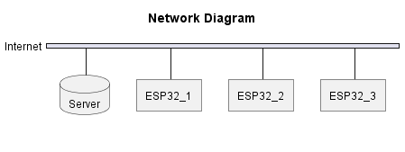

# T3-IOT-Klaslokaal

<!-- vscode-markdown-toc -->
* 1. [The Idea](#TheIdea)
	* 1.1. [Criteria [T.V. - N.T.]](#CriteriaT.V.-N.T.)
* 2. [Managing Expectations & Week 6 Deadline [N.T.]](#ManagingExpectationsWeek6DeadlineN.T.)
* 3. [Non Protocol Related Criteria [T.V.]](#NonProtocolRelatedCriteriaT.V.)
* 4. [Task 1 - Specify IoT Protocol](#Task1-SpecifyIoTProtocol)
	* 4.1. [How does MQTT fit within the criteria? [T.V.]](#HowdoesMQTTfitwithinthecriteriaT.V.)
* 5. [Roles](#Roles)
* 6. [Research setup [N.T. - T.V.]](#ResearchsetupN.T.-T.V.)
	* 6.1. [Software Tools](#SoftwareTools)
		* 6.1.1. [ WireShark](#imgsrchttps:upload.wikimedia.orgwikipediacommonsthumbddfWireshark_icon.svg1200px-Wireshark_icon.svg.pngaltWireSharkLogoheight15pxWireShark)
		* 6.1.2. [ VSCode](#imgsrchttps:upload.wikimedia.orgwikipediacommonsthumb99aVisual_Studio_Code_1.35_icon.svg2048px-Visual_Studio_Code_1.35_icon.svg.pngaltVSCodeLogoheight15pxVSCode)
		* 6.1.3. [ NodeRed](#imgsrchttps:nodered.orgaboutresourcesmedianode-red-icon.pngaltNodeRedLogoheight15pxNodeRed)
	* 6.2. [Local Hosting](#LocalHosting)
	* 6.3. [Network Setup](#NetworkSetup)
	* 6.4. [Measuring Power Draw](#MeasuringPowerDraw)
	* 6.5. [Application of DOT Framework](#ApplicationofDOTFramework)
	* 6.6. [Criteria for the protocol](#Criteriafortheprotocol)
* 7. [Protocol - MQTT](#Protocol-MQTT)
	* 7.1. [Basics [N.T.]](#BasicsN.T.)
	* 7.2. [Message Structure  [T.V.]](#MessageStructureT.V.)
	* 7.3. [Quality of Service [N.T.]](#QualityofServiceN.T.)
		* 7.3.1. [QoS 0 - At Most Once](#QoS0-AtMostOnce)
		* 7.3.2. [QoS 1 - At Least Once](#QoS1-AtLeastOnce)
		* 7.3.3. [QoS 2 - Exactly Once](#QoS2-ExactlyOnce)
* 8. [Task 2 - Implement IoT Protocols](#Task2-ImplementIoTProtocols)
	* 8.1. [Design](#Design)
	* 8.2. [Hardware [T.V. - N.T.]](#HardwareT.V.-N.T.)
	* 8.3. [Limitations [N.T.]](#LimitationsN.T.)
	* 8.4. [MQTT [T.V.]](#MQTTT.V.)
	* 8.5. [HTTP [T.V. - N.T.]](#HTTPT.V.-N.T.)
* 9. [Experiment](#Experiment)
	* 9.1. [Hypothesis [T.V. - N.T.]](#HypothesisT.V.-N.T.)
	* 9.2. [Measurements](#Measurements)
		* 9.2.1. [MQTT [T.V. - N.T.]](#MQTTT.V.-N.T.)
		* 9.2.2. [HTTP [T.V. - N.T.]](#HTTPT.V.-N.T.-1)
		* 9.2.3. [Conclusion [T.V. - N.T.]](#ConclusionT.V.-N.T.)
* 10. [Sources](#Sources)

<!-- vscode-markdown-toc-config
	numbering=true
	autoSave=true
	/vscode-markdown-toc-config -->
<!-- /vscode-markdown-toc -->

<br><br><br>
<br>

<!-- Filler! It's filler time -->

##  1. <a name='TheIdea'></a>The Idea

Our plan is to create a quasi smart classroom. Our aim is to allow for an automated lighting setup, which would allow for a more efficient use of energy and improve usability. In addition to this, we aim to measure the temperature & humidity in the classroom, so we could use this data for climate control purposes. While there are many sensors that could be beneficial to a classroom setting, such as a CO2 sensor, we will at most only be implementing a DHT sensor. The sensors or actuators are not the focus of this project, but rather the communication between the client and server.

###  1.1. <a name='CriteriaT.V.-N.T.'></a>Criteria [T.V. - N.T.]

Certain factors are crucial in this scenario, such as the possibility of losing some packets while ensuring the reception of other packets is imperative. For instance, missing a few packets of temperature data is acceptable, but receiving all packets of light data is necessary to prevent leaving the lights on or off.

Moreover, it is essential that the system be easily and inexpensively implemented, which can be achieved by utilizing pre-existing infrastructure, like Wi-Fi, to minimize installation expenses.

As the data to be transmitted is not sensitive, the level of security required does not need to be overly stringent.

The system must be dependable to prevent the lights from being switched on or off for an extended period. It should also be low maintenance and not require constant monitoring.

To ensure that the delay in turning the lights on or off is not noticeable, the response time should not exceed 200ms. This duration is selected as it is the threshold for human perception of delay.

##  2. <a name='ManagingExpectationsWeek6DeadlineN.T.'></a>Managing Expectations & Week 6 Deadline [N.T.]

| Week | Main Task |
| --- | --- |
| 1 | Concepting & Design |
| 2 | Research & Prototyping |
| 3 | Implement & Test MQTT |
| 4 | Implement & Test HTTP |
| 5 | Measurements & Testing |
| 6 | Report |

##  3. <a name='NonProtocolRelatedCriteriaT.V.'></a>Non Protocol Related Criteria [T.V.]

The system would not require any batteries because it is connected to the mains power. The reason it can be connected to the mains power is because the nodes are located at mounting points for lights or switches. This means that the nodes have access to a power source, and will not need to be battery powered.

##  4. <a name='Task1-SpecifyIoTProtocol'></a>Task 1 - Specify IoT Protocol

We have decided that we will use MQTT as our protocol of use because MQTT seems like a skill that can be used often in a DIY environment. This, along with the unique nature of a Subscriber & Publisher model, makes it an intriguing protocol to use.

###  4.1. <a name='HowdoesMQTTfitwithinthecriteriaT.V.'></a>How does MQTT fit within the criteria? [T.V.]

MQTT (Message Queuing Telemetry Transport) is a scalable messaging protocol that is well-suited to meet many of the criteria outlined in the context provided.

Firstly, MQTT can handle packet loss efficiently through its use of the Quality of Service (QoS) levels, which allow for different levels of acknowledgement and retransmission. For instance, QoS level 1 guarantees at least once delivery of messages, while level 2 ensures exactly once delivery, making sure that critical packets are received.

Secondly, MQTT is designed to be easily and inexpensively implemented. It can operate on top of existing infrastructure such as Wi-Fi, Ethernet, and cellular networks, making it a cost-effective option for IoT (Internet of Things) applications.

Thirdly, MQTT can provide encryption and authentication to secure data transmission if required, although it is not a mandatory feature, as the context suggests that the data is not sensitive.

Lastly, MQTT has built-in reliability mechanisms, including session persistence and last will and testament (LWT) features, to ensure that messages are reliably delivered, even in the case of connectivity issues or unexpected disconnections.

##  5. <a name='Roles'></a>Roles

We have divided the roles to make sure both of is work on both protocols and that we both achieve the nescessary goals to finish the project.

We've made careful consideration regarding our own skills, as well as making sure we both handle server & client side of the project. We've made sure to split the work in a way that gives both of us a chance to learn new things, while also making sure we both have a chance to work on the things we're more comfortable with.

| Task | MQTT | HTTP |
| --- | --- | --- |
| Server | Tom | Nathan |
| Clients | Nathan | Tom |
| Research | Tom & Nathan | Tom & Nathan |

##  6. <a name='ResearchsetupN.T.-T.V.'></a>Research setup [N.T. - T.V.]

###  6.1. <a name='SoftwareTools'></a>Software Tools

####  6.1.1. <a name='imgsrchttps:upload.wikimedia.orgwikipediacommonsthumbddfWireshark_icon.svg1200px-Wireshark_icon.svg.pngaltWireSharkLogoheight15pxWireShark'></a> WireShark

We will use WireShark to capture and analyze network traffic. This will allow us to see how the data is being sent and what (if any) handshakes take place.

####  6.1.2. <a name='imgsrchttps:upload.wikimedia.orgwikipediacommonsthumb99aVisual_Studio_Code_1.35_icon.svg2048px-Visual_Studio_Code_1.35_icon.svg.pngaltVSCodeLogoheight15pxVSCode'></a> VSCode

We have decided to both use VSCode because we are both very familiar with this IDE and it offer an extension called `PlatformIO`. This extension allows us to easily develop code for the ESP32 we will be using for this assignment.

####  6.1.3. <a name='imgsrchttps:nodered.orgaboutresourcesmedianode-red-icon.pngaltNodeRedLogoheight15pxNodeRed'></a> NodeRed

For the MQTT server we will be using NodeRed. This is a visual programming tool that allows us to easily create a MQTT server. This will allow us to easily test our MQTT clients. It will also allow us to create a HTTP server that should allow us to test our HTTP clients easily.

This tool also allows for fast itteration on the server side of the project, as we can easily change the server without having to write complex code.

###  6.2. <a name='LocalHosting'></a>Local Hosting

For the purposes of rapid prototyping, we'll be testing our applications using locally hosted servers. This has the added benefit of not needing to use FTP or other network connections, as well as being able to easily read the data that is sent over the network.

###  6.3. <a name='NetworkSetup'></a>Network Setup

We will be using a relatively simple setup with at least a single ESP32. This will allow us to focus on analyzing the protocol instead of the network setup. It is possible that we will add more ESP32's to the network, but this is not likely.

The ESP32's will simple connect to WiFi and connect with the chosen protocol via that.



###  6.4. <a name='MeasuringPowerDraw'></a>Measuring Power Draw

We will be measuring the power draw of the ESP32 using the datasheet Espressif provides. We can combine this data with time measurements to calculate the power draw of the ESP32.

###  6.5. <a name='ApplicationofDOTFramework'></a>Application of DOT Framework

For this project, we'll be focusing on rapid prototyping, and thus be making thorough use of Workshop - Prototype. This will allow us to quickly create a prototype of our project, and then iterate on it to make it better.

In addition to this, we'll be making use of Library - Literature study, to inform ourselves about the protocols we'll be using.

###  6.6. <a name='Criteriafortheprotocol'></a>Criteria for the protocol

For the purposes of this project, a protocol should be able to:
 - Send data reliably
 - Send data quickly
 - Send data with low power draw
 - Send data with low overhead

##  7. <a name='Protocol-MQTT'></a>Protocol - MQTT

###  7.1. <a name='BasicsN.T.'></a>Basics [N.T.]

MQTT is an IoT protocol, which uses a so called "Publish - Subscribe" model. This means that a device measures data, after which it gets sent to the broker.
This in turn, gets sent to all devices that have subscribed to receive the data.


###  7.2. <a name='MessageStructureT.V.'></a>Message Structure  [T.V.]

The message structure of MQTT is quite simple. It consists of a fixed length control header, variable length (but always present) packet length field, an optional variable length header and a optional variable length payload.


An example of a MQTT message is shown below.

```
{"topic":"TEMP","payload":"{"time":2901333,"sensor_a0":1440931204}","qos":0,"retain":false,"_topic":"TEMP","_msgid":"50e2451efa8d5fd8"}
```

What is notable is that the payload is a lot larger than just the data that was being sent. The data that was being sent was just the `time` and `sensor_a0` fields. So whilst the structure of the MQTT message seems like it could be relatively small, in practice it has quite a large overhead (especially for small packets of actual data).

###  7.3. <a name='QualityofServiceN.T.'></a>Quality of Service [N.T.]

Quality of Service (henceforth refered to as QoS), is a system of verifying that a message was sucessfully recieved. QoS is only used between the Publisher and Broker.

####  7.3.1. <a name='QoS0-AtMostOnce'></a>QoS 0 - At Most Once

QoS 0 is the most basic version of QoS. At QoS 0, there is no verification that data was recieved by the broker. Nicknamed the "Fire & Forget" approach, it reduces alot of overhead QoS 1 and 2 implement. This is typically used for data that is sent often, or isn't considered mission critical.


####  7.3.2. <a name='QoS1-AtLeastOnce'></a>QoS 1 - At Least Once

QoS 1 implements basic verification of data. Once the publisher has sent data to the broker, the broker sends a packet (Called a PUBACK) to the client, with a packetID. This allows the publisher to know if the data has arrived at the server. If the publisher needs to send the data again, it applies a DUP (duplicate) flag to the packet. This is handled internally, but not processed by the broker.

QoS 1 is used when the data is mission critical, but not time sensitive.


####  7.3.3. <a name='QoS2-ExactlyOnce'></a>QoS 2 - Exactly Once

QoS 2 is a more exact way of dealign with message verifycation. QoS 2 makes sure that a message is recieved **exactly** once. This is done by sending a PUBREC packet to the publisher, which contains a packetID. The publisher then sends a PUBREL packet to the broker, which contains the packetID. The broker then sends a PUBCOMP packet to the publisher, which contains the packetID.

QoS 2 is used when the data is mission critical, and receiving the data twice could cause problems.


##  8. <a name='Task2-ImplementIoTProtocols'></a>Task 2 - Implement IoT Protocols

###  8.1. <a name='Design'></a>Design

We've started by creating some rudimentary designs for both the network packages we intend to send, as well as the server & client side of the project.

###  8.2. <a name='HardwareT.V.-N.T.'></a>Hardware [T.V. - N.T.]

For actual sensor values we decided to generate random values, as implementing actual sensors and or actuators is not within the scope of this assignment.

We've decided to use an ESP32 as the client for the project, as it has a built in WiFi module, and is extremely easy to use. It also has a lot of documentation and examples, which makes it easy to get started with.

For the server we have decided to simply use a PC / Laptop because it is complete overkill to use a Virtual Machine or Server provided by Fontys for this. If this project would last the entire term, it would be a different story, but for now it is not needed.

###  8.3. <a name='LimitationsN.T.'></a>Limitations [N.T.]

Due to the way the Network at Fontys is setup, it's not possible to actually connect over the internet to our devices. This is due to the fact that Fontys uses WPA-2 Enterprise, which requires both a username and password, something most (if not all) libraries. We'll be using a router from the ISSD.

###  8.4. <a name='MQTTT.V.'></a>MQTT [T.V.]

NodeRed allows us to implement a MQTT server in a very simple manner. Tom has some previous experience with NodeRed, and thus it was a natural choice for us.

The data will be sent and received via topics. The topics will be as follows:

| Topic | Payload | Example |
| --- | --- | --- |
| `ESP32/LIGHT` | bool | `TRUE` |
| `ESP32/TEMP` | int | `23` |
| `ESP32/HUM` | int | `11` |

Due to the nature of this assignment, the data will not be permanently stored. This means that the data will be sent to the broker, entered into a graph, and when the graph is closed, the data will be lost.

The setup of the server is quite simple, using only a handful of nodes.


The `Aedes MQTT broker` node is our MQTT broker, in this node we set up our connection settings (port) and our security settings. The Aedes broker is not a unique protocol or version of the MQTT protocol. It comes from a NodeRed library called `node-red-contrib-aedes`, and is used to create a MQTT server on the local network. It also allows us to subscribe and publish to topics, allowing us to actually implement our setup.

There are two incoming nodes, one for the temperature, and one for the humidity. These nodes are used to subscribe to the topics, and receive the data. The data is then sent to two nodes, one for debugging, and one for the graph. The debugging node is present in case we are not confident if data is arriving at the broker. The graph node is used to display the data in a graph to show that the data is correctly being received. The graphs are displayed on the dashboard.

There is one outgoing node, this node is used to send commands to the esp32. This is used to turn the light on and off. The commands are generated by a switch on the dashboard. Every time the switch is toggled, the command is sent to the esp32.

The dashboard is used to display the graphs, as well as the switch to turn the light on and off.


###  8.5. <a name='HTTPT.V.-N.T.'></a>HTTP [T.V. - N.T.]

For the HTTP side of this project, we used a very simple implementation. We used node red again to allow us to focus entirely on the research part of this assignment, and not on the implementation part.

We used the exact same message structure as we did for MQTT, as this allows us to make an effective comparison between the two protocols.


There are three nodes present. The first node, `[post] /temp` is the actual point where data gets received. This node has no other functionality other than to listen. This node activates on arrival of correct data (correct as in valid HTTP). The second node is the `http (200)` node. This node gets activated by the first node, and sends a 200 OK response to the client. The third node is the `msg.payload` node. We use this node to visualize the arrival of the data to make sure that we are actually receiving data.

This time we did not implement any dashboard.

##  9. <a name='Experiment'></a>Experiment

###  9.1. <a name='HypothesisT.V.-N.T.'></a>Hypothesis [T.V. - N.T.]

We expect that MQTT will have larger data sizes than HTTP because of the overhead of the protocol. Because of this, we also expect the MQTT protocol to use more power on the same chip due to longer transmitting and receiving times. In terms of speed (bytes per second) we do not expect a large difference between the two protocols, as the data size is not that large. But because we expect MQTT to have larger data packets, we expect it to take longer.

###  9.2. <a name='Measurements'></a>Measurements

####  9.2.1. <a name='MQTTT.V.-N.T.'></a>MQTT [T.V. - N.T.]

##### Data Size

We used WireShark to measure the data size of the MQTT packets. One flaw in our measurements was that we did not simulate packet loss. Simulating this would have taken too much time.

Size fields are average over 10 measurements rounded to the nearest whole number.

| DataSize (Bytes) | TotalSize (Bytes) | QoS |
| --- | --- | --- |
| 39 | 441 | 2 |
| 39 | 325 | 1 |
| 39 | 265 | 0 |


_QoS 2 measurements_


_QoS 1 measurements_


_QoS 0 measurements_

##### Power Consumption

| Active Transmission | Active Receiving | Idle |
| --- | --- | --- |
| ~300mA | ~100mA | ~30mA |

[Espressif ESP32-S3-WROOM-1 Datasheet]

To get close to the real figure, we will assume the ESP32 transmits 50% of the time and actively listens the other 50% of the time. This gets us to a total of 200mA. Then we measured the time to took the ESP32 to send a message using the internal clock of the ESP32. We performed 34 measurements and averaged them to get the following result:

QoS 0: Average of 0.003 seconds per message


QoS 1: Average of 0.176 seconds per message


An interesting observation is that there are 2 outliers in the QoS 1 measurements of a message time of 1004 ms. These outliers are caused by the ESP32 losing connection to the server. This phenomenon is present is the QoS 2 readings as well. After the ESP32 was positioned differently, the outliers were no longer present and the connection kept stable.

QoS 2: Average of 0.200 seconds per message


Per message:

| Time (s) | QoS | mAs |
| --- | --- | --- |
| 0.200 | 2 | 40.0 |
| 0.176 | 1 | 35.2 |
| 0.003 | 0 | 00.6 |

_Provided the device has already connected to the network and subscribed to the topics_

##### Impact on possible infrastructure

Per floor:
| Lights | Temperature | Humidity |
|---|---|---|
| 46 | 15 | 46 |

_Total: 107 Groups per floor_

For R10:

R10 has 5 floors. This means there are a total of 535 groups needed for the entire building.

Data bandwidth per QoS level

For the purposes of this experiment, we will assume that a light is turned on/off twice per hour, while temperature and humidity are measured every 5 minutes. On an hourly basis, this means that the following data is sent:

| Unit | Light | Temperature | Humidity | Total |
| --- | --- | --- | --- | --- |
| Group | 2 | 12 | 12 | 26 |
| Floor | 214 | 1,284 | 1,284 | 2,782 |
| Building | 1,070 | 5,642 | 5,642 | 13,910 |

_Messages sent per hour_

By combining the previous table with the data we measured when we were measuring the impact of QoS on the packets being sent, gives us the following table:

| Unit | QoS 0 (B/h)| QoS 1 (B/h)| QoS 2 (B/h)|
| --- | --- | --- | --- |
| Group | 6,890 | 8,450 | 11,466 |
| Floor | 737,230 | 904,150 | 1,226,862 |
| Building | 3,686,150 | 4,520,750 | 6,134,310 |

_Bytes per hour_

From this, we can see a clear increase in the number of bytes sent per hour, as the QoS level increases. This is because the QoS level determines the number of handshakes that are performed. The more handshakes, the more data is sent. This is also the reason why the QoS level 2 has the highest impact on the network, whereas QoS 0 sends almost half the data.

| Unit | QoS 0 (mAs)| QoS 1 (mAs)| QoS 2 (mAs)|
| --- | --- | --- | --- |
| Group | 0.6 | 35.2 | 40.0 |
| Floor | 64.2| 3766.4 | 4280.0 |
| Building | 321 | 18,832 | 21,440 |

We can see a clear increase in both the data sent and the power consumption as the QoS level increases. This is because the QoS level determines the number of handshakes that are performed. The more handshakes, the more data is sent, as well as more time being spent in a connected state, which requires additional power.
This means that for the implementation, we will have to find a way to strike a balance between the data arriving at the destination, as well as the power consumption.

####  9.2.2. <a name='HTTPT.V.-N.T.-1'></a>HTTP [T.V. - N.T.]

##### Data Size

We used WireShark to measure the data size of the MQTT packets. One flaw in our measurements was that we did not simulate packet loss. Simulating this would have taken too much time.

Size fields are average over 10 measurements rounded to the nearest whole number.

| DataSize (Bytes) | TotalSize (Bytes) |
| --- | --- |
| 39 | 1236 |


##### Power Consumption

| Active Transmission | Active Receiving | Idle |
| --- | --- | --- |
| ~300mA | ~100mA | ~30mA |

[Espressif ESP32-S3-WROOM-1 Datasheet]

To get close to the real figure, we will assume the ESP32 transmits 50% of the time and actively listens the other 50% of the time. This gets us to a total of 200mA. Then we measured the time to took the ESP32 to send a message using the internal clock of the ESP32. We performed 34 measurements and averaged them to get the following result:


Per message:

| Time (s) | mAs |
| --- | --- |
| 0.433 | 86.6 |

_Provided the device has already connected to the network and server_

##### Impact on possible infrastructure

Per floor:
|Lights|Temperature|Humidity|
|---|---|---|
| 46 | 15 | 46 |

_Total: 107 Groups per floor_

For R10:

R10 has 5 floors. This means there are a total of 535 groups needed for the entire building.

Data bandwidth

This does assume that every sensor and switch available is being used. This is not exactly a realistic scenario for most purposes, but does allow for a worst case scenario.

| Unit | B/s |
| --- | --- |
| Group | 2,854 |
| Floor | 305,431 |
| Building | 1,527,159 |

_Data per Second_

| Unit | mAs|
| --- | --- |
| Group | 86.6 |
| Floor | 9,266.2 |
| Building | 46,331 |

_Power draw_

####  9.2.3. <a name='ConclusionT.V.-N.T.'></a>Conclusion [T.V. - N.T.]

##### MQTT vs HTTP

Our priorities within the implementation of this assignment were:

* Power consumption
  * The protocol should not use too much power

| MQTT | HTTP |
| --- | --- |
| 40.0 mAs - 00.6 mAs | 86.6 mAs |

* Overhead
  * The protocol should not use too much bandwidth

| MQTT | HTTP |
| --- | --- |
| 226 B - 402 B | 1,197 B |

_overhead in Bytes_

* Reliability
  * The protocol should be able to make sure a message arrives at least once (or exactly once)

| MQTT | HTTP |
| --- | --- |
| QoS selection | Only TCP guarantee |

* Time
  * The protocol should be able to send a message in a reasonable amount of time

| MQTT | HTTP |
| --- | --- |
| 0.200 s - 0.003 s | 0.433 s |

Criteria | MQTT | HTTP
--- | --- | ---
Power Consumption | 1 | 0 |
Overhead | 1 | 0 |
Reliability | 1 | 1 |
Time | 1 | 0 |
Totals | 4 | 1 |

From our research we can conclude that MQTT would be the best protocol for us by a landslide. It uses less power, has less overhead, is more reliable and is faster than HTTP. MQTT is the clear winner in this case. One big downside of HTTP is that HTTP can take up to 433ms to send a message. This is way above the 200ms that it takes for a human to notice a delay. This means that HTTP is not suitable for our use case.

##### QoS 0 vs QoS 1 vs QoS 2

Whilst MQTT is the clear winner over HTTP, we still have to decide which QoS level to use. We have to take into account the following criteria:

* Reliability
  * The protocol should be able to make sure a message arrives at least once (or exactly once)
* Bandwidth
  * The protocol should not use too much bandwidth when its not needed

Criteria | QoS 0 | QoS 1 | QoS 2
--- | --- | --- | ---
Reliability | 0 | 1 | 1 |
Bandwidth | 0 | 0 | -1 |
Totals | 0 | 1 | 0 |

From our research we can conclude that QoS 1 would be the best option for us. We do not need data to arrive _exactly_ once, but we do need our data to arrive _at least_ once. This means that QoS 0 is out of the question. Between QoS 1 and QoS 2 the biggest difference is that QoS 2 uses a lot more power and takes more time. QoS 2 is almost slow enough for it to be noticeable by humans (~200ms). This means that QoS 1 is the best option for us.

##### Hypothesis Retrospective

It turns out our hypothesis was incorrect. MQTT has smaller data sizes than HTTP and it also uses less power. Because HTTP takes a considerably longer time to transmit messages, it has a smaller maximum bandwidth.

It turns out our hypothesis could not have been further from the truth.

##  10. <a name='Sources'></a>Sources

steve. 2017. ‘Understanding the MQTT Protocol Packet Structure’. Retrieved 10 March 2023 (http://www.steves-internet-guide.com/mqtt-protocol-messages-overview/).

Team, The HiveMQ. n.d.-a. ‘Publish & Subscribe - MQTT Essentials: Part 2’. Retrieved 3 March 2023 (https://www.hivemq.com/blog/mqtt-essentials-part2-publish-subscribe/).

Team, The HiveMQ. n.d.-b. ‘Quality of Service (QoS) 0,1, & 2 MQTT Essentials: Part 6’. Retrieved 3 March 2023 (https://www.hivemq.com/blog/mqtt-essentials-part-6-mqtt-quality-of-service-levels/).

Espressif. n.d.-b. ‘ESP32-S3-WROOM-1 Datasheet. Retrieved 10 March 2023 (https://www.espressif.com/sites/default/files/documentation/esp32-s3-wroom-1_wroom-1u_datasheet_en.pdf)
