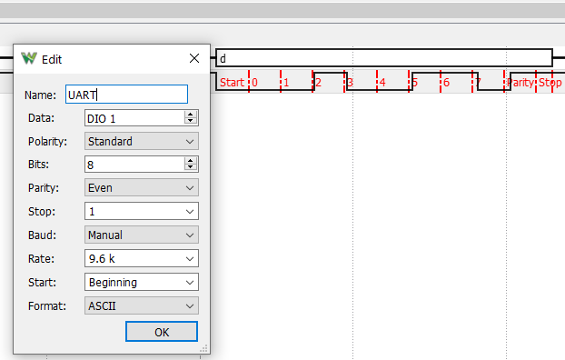
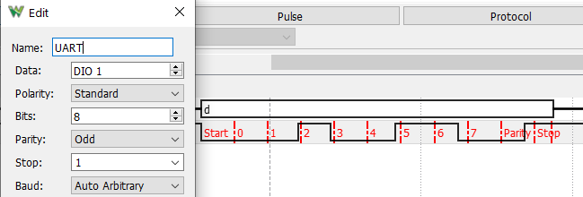
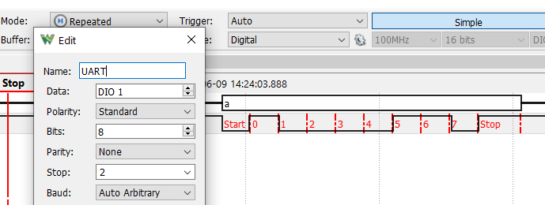
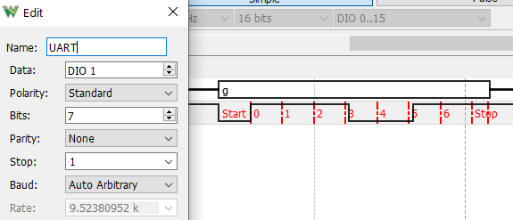
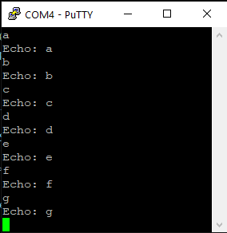

# UART

## Introduction

The purpose of this project is to create a software UART solution, using the GPIO pins for reading the data. This would in turn, allow itself to be used as an in-field debugging tool, allowing me to attach the device to the lines of a serial communication, and read the data being sent.

## Requirements

The following requirements are in place for the project:

- I must be able to read data at a baudrate of AT LEAST 9600.
- I must support multiple data configurations, including:
  - 7-8 data bits
  - 1-2 stop bits
  - Even/Odd/No parity

The system is built on two seperate modules, namely the transmitter and the reciever. The transmitter is responsible for recieving data via USB serial, and then converting it into a bitstream. The reciever is responsible for reading the bitstream, and converting it into a byte.

The transmitter can be verified using the Analog Discovery 2, which additionally allows for a fair bit of debugging. The receiver can be debugged using PuTTY, or another serial monitor.

## Theory

### Timing

Timing is absolutely crucial in this project. While optimisations are usually not the bread and butter of these kind of programming challenges, they are absolutely crucial in this case. The reason for this is that the timing of the bits is crucial to the correct operation of the system. If the timing is off, the system will not be able to read the data correctly, resulting in garbage data. The timing for correctly reading the data is as follows:

| Baudrate | Time per bit (µs) |
| -------- | ----------------- |
| 300      | 3333              |
| 600      | 1667              |
| 1200     | 833               |
| 2400     | 417               |
| 4800     | 208               |
| 9600     | 104               |
_The above table shows the time per bit for a given baudrate_

The timings above show that significant performance optimisations need to be implemented, to allow for the speeds that the system requires to correctly read the data. Some preemptive optimisations I can think of include:

- Using a for loop instead of while loops
- Reading registers instead of arduino function calls

For the purposes of calculating the time between bits, there is a fairly simple calculation we can do:

```cpp
constexpr int baudrate = 9600;
constexpr int bitTime = 1000000 / baudrate; // This will give us the actual time in microseconds
```

When combined with the `micros()` function, we can accurately keep track of the time between bits.

```cpp
  for (int i = 0; i < numberOfBits; i++)
  {
    while(micros() < nextBitTime)
    {
    }
    nextBitTime = micros() + TimePerBit;
    digitalWrite(OUTPUT_PIN, exportByte[i]);
  }
```

While I did mention avoiding while loops above, this while loop has a very specific & niche function. It simply continously polls the `micros()` function, until the time has elapsed. This is a very simple way of keeping track of the time, and is surprisingly accurate.

### Sampling

```cpp
constexpr int baudrate = 9600;
constexpr int sampleBits = 3;
constexpr int totalBits = 10; // 1 start bit, 8 data bits, 1 stop bit. This is purely for explanation
constexpr int BitsToSample = sampleBits * totalBits;
constexpr int SampleTime = (1000000 / baudrate) / sampleBits; // This will give us the actual time in microseconds
```

We can then use this timing instead of bitTime, to allow us to use the following code in the reciever:

```cpp
  for (int i = 0; i < BitsToSample; i++)
  {
      while (micros() < nextBitTime)
      {
      }
      SampleBits[i] = PIND & 0b00000100;
      nextBitTime = micros() + SampleTime;
  }
```

This code will sample the bits at the correct time, and store them in an array. This array can then be used to determine the value of the bit. At a later stage, we can calculate what the bit was intended to be by using the following code:

```cpp
for (int i = 0; i < numberOfBits; i++)
{
    for (int j = 0; j < numberOfSamples; j++)
    {
        Bits[i] += SampleBits[i * numberOfSamples + j];
    }
    Bits[i] = (Bits[i] >= RequiredSampleThreshold);
}
```

The main reason for not doing this in the original loop is to save performance. The reading loop should NOT be used to calculate if the data is correct, as this will result in the system desynchronising from the data.

## Designs

### Wiring

The wiring behind both the reciever and transmitter are nigh identical. The tranmitter and reciever both operate using the same pin, and the only difference is the direction of the data. The transmitter will send data to the pin, while the reciever will read data from the pin. The reciever is plugged into an CH340G Serial to UART converter, which is then plugged into the computer. The transmitter is plugged into the computer directly, but for debugging purposes can be attached to an Analog Discovery 2.


### State Machines


## Implementation

### Transmitter

The transmitter is responsible for reading the data from the serial port, and converting it into a bitstream. The bitstream is then sent to the reciever, which converts it into a byte.

While it can easily read any data via the serial port, it will be required to send the data in a specific format. The format is specified when the program is uploaded, and consists of differing number of data & stop bits, as well as parity.

#### Proof










### Reciever

The reciever is responsible for reading the bitstream, and converting it into a byte. The byte is then sent to the serial port, where it can be read by the user.

The following images were made by attaching the reciever to a CH340G Serial to UART device, which allowed me to send data to the arduino via the designated reciever pin.



This proved that my 8n1 configuration worked, and later I tested for various other configurations, just like the transmitter.

Due to the fact I send back data via serial (as the transmitting with correct timing was handled by another system), I had to get a bit creative with testing. The data was sent by the CH340, recieved by the arduino, and then sent back to the CH340 as well as an Analog Discovery 2. The Analog Discovery 2 was used to verify that the data was correct, and the CH340 was used to send the data back to the computer.

## Conclusion

The project was a success, and I was able to program both the reciever and the transmitter to work together. The transmitter is able to send data at a baudrate of 9600, and the reciever is able to read the data at the same baudrate. The reciever is also able to read the data at a baudrate of 9600.
Admittedly, I was incredibly nervous as to if I was actually going to finish this on time. Thanks to Felix for the super helpful debugging session during his lunch break, we were able to fix the transmitter. This code base then proved essential in creating the reciever, as I knew that the code for reading the data was correct and could function at the required baudrate.
