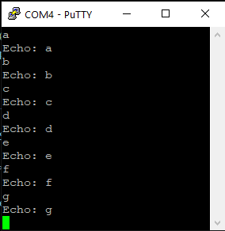

# UART

## Introduction

The purpose of this project is to create a software UART solution, using the GPIO pins for reading the data. This would in turn, allow itself to be used as an in-field debugging tool, allowing me to attach the device to the lines of a serial communication, and read the data being sent.

## Requirements

The following requirements are in place for the project:

- I must be able to read data at a baudrate of AT LEAST 9600.
- I must support multiple data configurations, including:
  - 7-8 data bits
  - 1-2 stop bits
  - Even/Odd/No parity

The system is built on two separate modules, namely the transmitter and the receiver. The transmitter is responsible for receiving data via USB serial, and then converting it into a bitstream. The receiver is responsible for reading the bitstream and converting it into a byte.

The transmitter can be verified using the Analog Discovery 2, which additionally allows for a fair bit of debugging. The receiver can be debugged using PuTTY, or another serial monitor.

## Theory

### Bit Order

One of the major aspects of UART is the bit order. The bit order determines if the first bit is the Most Significant Bit or the Least Significant bit. For my own sanity, as well as ease of programming, I decided to go for a Least Significant first approach. This is, coincidentally, the default for a most devices, which means I do not need to invert the reading process. This does mean that turning it into a valid value will require me to invert the order of the bits, but this is a straightforward process.


Using the above image as an example, the bit order is `10000110`, which when reversed, corresponds to the numerical value of `97`, which is the ASCII value for `a`.

### Timing

Timing is crucial in this project. While optimizations are usually not the bread and butter of these kind of programming challenges, they are crucial in this case. The reason for this is that the timing of the bits is crucial to the correct operation of the system. If the timing is off, the system will not be able to read the data correctly, resulting in garbage data. The timing for correctly reading the data is as follows:

| Baudrate | Time per bit (µs) |
| -------- | ----------------- |
| 300      | 3333              |
| 600      | 1667              |
| 1200     | 833               |
| 2400     | 417               |
| 4800     | 208               |
| 9600     | 104               |
_The above table shows the time per bit for a given baudrate_

The timings above show that significant performance optimizations need to be implemented, to allow for the speeds that the system requires to correctly read the data. Some pre-emptive optimizations I can think of include:

- Using a for loop instead of while loops
- Reading registers instead of arduino function calls

For the purposes of calculating the time between bits, there is a simple calculation we can do:

```cpp
constexpr int baudrate = 9600;
constexpr int bitTime = 1000000 / baudrate; // This will give us the actual time in microseconds
```

When combined with the `micros()` function, we can accurately keep track of the time between bits.

```cpp
  for (int i = 0; i < numberOfBits; i++)
  {
    while(micros() < nextBitTime)
    {
    }
    nextBitTime = micros() + TimePerBit;
    digitalWrite(OUTPUT_PIN, exportByte[i]);
  }
```

While I did mention avoiding while loops above, this while loop has a specific & niche function. It simply continuously polls the `micros()` function, until the time has elapsed. This is a quite straightforward way of keeping track of the time and is surprisingly accurate.

### Sampling

```cpp
constexpr int baudrate = 9600;
constexpr int sampleBits = 3;
constexpr int totalBits = 10; // 1 start bit, 8 data bits, 1 stop bit. This is purely for explanation.
constexpr int BitsToSample = sampleBits * totalBits;
constexpr int SampleTime = (1000000 / baudrate) / sampleBits; // This will give us the actual time in microseconds
```

We can then use this timing instead of bitTime, to allow us to use the following code in the receiver:

```cpp
  for (int i = 0; i < BitsToSample; i++)
  {
      while (micros() < nextBitTime)
      {
      }
      SampleBits[i] = PIND & 0b00000100;
      nextBitTime = micros() + SampleTime;
  }
```

This code will sample the bits at the correct time and store them in an array. This array can then be used to determine the value of the bit. At a later stage, we can calculate what the bit was intended to be by using the following code:

```cpp
for (int i = 0; i < numberOfBits; i++)
{
    for (int j = 0; j < numberOfSamples; j++)
    {
        Bits[i] += SampleBits[i * numberOfSamples + j];
    }
    Bits[i] = (Bits[i] >= RequiredSampleThreshold);
}
```

The main reason for not doing this in the original loop is to save performance. The reading loop should NOT be used to calculate if the data is correct, as this will result in the system desynchronizing from the data.

## Designs

### Wiring

The wiring behind both the receiver and transmitter are nigh identical. The transmitter and receiver both operate using the same pin, and the only difference is the direction of the data. The transmitter will send data to the pin, while the receiver will read data from the pin. The receiver is plugged into an CH340G Serial to UART converter, which is then plugged into the computer. The transmitter is plugged into the computer directly, but for debugging purposes can be attached to an Analog Discovery 2.


### State Machines

Below is the state machine for the Receiver. It has separate states for all phases of the byte interpretation and will transition between them as required.


The transmitter has a much simpler state machine, as it only must read the data from the serial port and convert it into a bitstream.


## Implementation

### Transmitter

The transmitter is responsible for reading the data from the serial port and converting it into a bitstream. The bitstream is sent to the receiver, which converts it into a byte.

While it can easily read any data via the serial port, it will be required to send the data in a specific format. The format is specified when the program is uploaded and consists of differing number of data & stop bits, as well as parity.

#### Code

In this section, I will be covering the code around converting the retrieved data from the serial bus to the data that will be sent via GPIO. The code is split into several sections, each dealing with a specific part of the configuration.

For the design of my code, I had decided to use several for loops to manage the length of my data. This would mean that all bits of data would automatically be offset by the correct amount and would not require any changes beyond changing the overall configuration. This allows for great flexibility, though it does come at a slight cost to readability.

For the data bits, it is simple. We simply offset the data by the number of start bits, and then add the data bits. This is done in the following code:

```cpp
  for (int i = numberOfStartBits; 
       i < numberOfStartBits + numberOfDataBits;
       i++)
  {
    exportByte[i] = (inboundByte >> (i - numberOfStartBits)) & 1;
  }

```

By shifting the data to the left, we can simply read the bit at the current index, and then store it in the array. This is done for each bit, and then the array is sent further along the chain.

For the parity bits, it is a bit more complicated, due to having to calculate the parity as well. Luckily, it is quite simple. We evaluate to see if the current parity is equal to if we expect it to be even or odd and add a 1 if it is not. Below is a table for additional explanation.

| Number of High Bits | Odd Parity | Even Parity |
| ------------------- | ---------- | ----------- |
| 0                   | 1          | 0           |
| 3                   | 0          | 1           |
| 7                   | 0          | 1           |
| 8                   | 1          | 0           |

In code, this would result in the following:

```cpp
  for (int i = numberOfStartBits; i < numberOfDataBits; i++)
  {
    parityBit += exportByte[i];
  }
  ...

  parityBit = parityBit % 2; // This will give us odd or even

  if(parityBit != REQUESTED_PARITY)
  {
    parityBit += 1;
  }

  exportByte[numberOfStartBits + numberOfDataBits] = parityBit;
```

This will give us the correct parity bit and will allow us to send it to the receiver.

The stop bits are the simplest of all. We simply set the bits to 1, and then send it to the receiver. This is done in the following code:

```cpp
  for (int i = numberOfStartBits + numberOfDataBits + numberOfParityBits;
        i < numberOfBits;
        i++)
  {
    exportByte[i] = STOPBIT;
  }
```

#### Proof

Below is a working Transmitter at 300 baud, with 1 start bit, 8 data bits, 1 stop bit, and no parity.


Here is a Transmitter working at 9600 baud, with 1 start bit, 8 data bits, 1 stop bit, and no parity.


Here is a Transmitter working at 9600 baud, with 1 start bit, 8 data bits, 1 stop bit, and even parity.


Here is a Transmitter working at 9600 baud, with 1 start bit, 8 data bits, 1 stop bit, and odd parity.


Here is a Transmitter working at 9600 baud, with 1 start bit, 8 data bits, 2 stop bits, and no parity.


And finally, here is a Transmitter working at 9600 baud, with 1 start bit, 7 data bits, 1 stop bit, and no parity.


With this, I can safely say that the transmitter module works as intended and can support all the requirements set forth by the project.

### Receiver

The receiver is responsible for reading the bitstream and converting it into a byte. The byte is then sent to the serial port, where the user can read it.

The following images were made by attaching the receiver to a CH340G Serial to UART device, which allowed me to send data to the arduino via the designated receiver pin.

#### Code

The code for the receiver is significantly more difficult, as it must read the data from the GPIO pins and convert it into a byte. The code is split into several sections, each dealing with a specific part of the configuration.

As with the transmitter, I decided to use the same setup of for loops to manage my code. This has the same advantages and disadvantages as the transmitter.

For the data bits, this was extensively covered in the section about sampling and timing. A full explanation can be found there.

Parity works remarkably like the transmitter, though instead of inserting the parity into the data byte, to be sent over the protocol, it is instead used as a verification method, to assess that the incoming data is correct. The following code is responsible for checking if the parity is correct:

```cpp
bool CheckParity(int parityData)
{
  //Bits[number of start bits + number of data bits] is the location of the parity bit
  if(parityData + Bits[numberOfStartBits + numberOfDataBits] == REQUESTED_PARTIY)
  {
    currentState = ADD_TO_BUFFER;
    return true; 
  }
  else
  {
    Reset();
    currentState = IDLE;
    return false;
  }
}
```

Additionally, we can easily check if the stops bits arrived correctly, by simply checking if the expected stop bits are equal to the received stop bits. 

```cpp
    for (int i = numberOfStartBits + numberOfDataBits + numberOfParityBits;
          i < numberOfBits;
          i++)
    {
        if(Bits[i] != 1)
        {
            Reset();
            currentState = IDLE;
            return;
        }
    }
```

While there is always room in the buffer, the buffer has been initialized to 0. This means, that in the event of a reset, the buffer will be filled with 0's. If the system does not read the correct number of stop bits, this check will fail.

#### Proof



This proved that my 8n1 configuration worked.

After a fair bit of deliberation regarding how I could best show evidence regarding my ASCII Terminal and per extension, my receiver, I managed to capture footage using GIFS, which are included in the `Receiver Pictures` Folder. These GIFS showcase the various configurations I have managed to support using my receiver. Inside, you will find:

- `7 Data bits`
- `Odd Parity`
- `Even Parity`
- `Two Stop Bits`

With these gifs, I hope to show that my receiver works according to the requirements, alongside the demo given on the 27th of June.

## Conclusion

The project was a success, and I was able to program both the receiver and the transmitter to work together. The transmitter can send data at a baudrate of 9600, and the receiver is able to read the data at the same baudrate. The receiver is also able to read the data at a baudrate of 9600.
Admittedly, I was incredibly nervous as to if I was going to finish this on time. Thanks to Felix for the super helpful debugging session during his lunch break, we were able to fix the transmitter. This code base then proved essential in creating the receiver, as I knew that the code for reading the data was correct and could function at the required baudrate.
