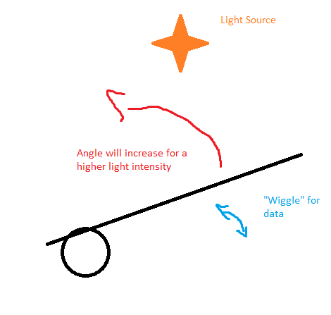
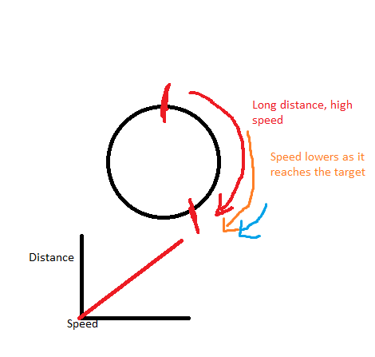
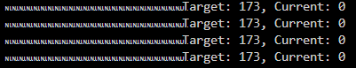
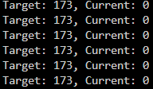

# Closed Loop Systems

## Concept

For this final assignment, the intention is to create a closed loop system using the various principles learned during the semester. The system will be inspired by a demo used by the technology department during one of their presentations, namely a system that uses a Light dependant resistor and servo to optimize lightfall into a solar panel.

For the purposes of this project, the aim is to control the position of the servo, by adjusting the speed. The servo can be set to rotate at a certain speed. By carefully controlling the speed, as well as keeping the timing under control, it should be possible to control the position of the servo by adjusting the speed as it gets closer to the target position. Below is a well crafted image showcasing the concept.

Putting the servo at an angle would allow us to consider the position as an angle. We can wiggle the LDR around to see which direction gets more light. By heading in that direction by adjusting the speed and hence the position, we can get the servo to point in the angle of the most light.



## ADC Troubles

For the project, I would need to make use of the ADC converter on the STM32. This is a 12 bit converter, which means that it can convert a voltage between 0 and 3.3V into a value between 0 and 4095. This is a very high resolution, and should be more than enough for my purposes. I decided to implement the following code to activate the ADC, but it didn't seem to work.

```cpp
for(;;)
{
    HAL_ADC_Start(&hadc1);
    HAL_ADC_PollForConversion(&hadc1, 1);
    osMutexAcquire(LightIntensityMutex,osWaitForever);
    previousLightIntensity = LightIntensity;
    LightIntensity = HAL_ADC_GetValue(&hadc1);
    osMutexRelease(LightIntensityMutex);
    osDelay(50);
}
```

When I got no output however, I was thoroughly confused. After doing some investigation, I discovered that I needed to add the ADC to my project via the STM32 Cube IDE.

After integrating this, I copied over the ADC specific code, but It didn't seem to work in my project. After some discussing with Rene, it turned out that I had to add the ADC startup code to the `stm32fxx_hal_msp.c` file, from which I could then add the ADC to my project.

Doing this, allowed me to get the ADC working, and I got the values I was expecting from the LDR. Below are the maximum and minimum values I got from the LDR.

| Value | Voltage | Description |
| ----- | ------- | ----------- |
| 2849 | 2.2V | Minimum light detected |
| 4027 | 3.2V | Maximum light detected |

The main reason for not hitting the expected minimum value of roughly 0, is due to the ambient lighting in the room, which was not completely dark. Despite my best attempts to cover the LDR, I was unable to get the value to drop below 2849. More investigation into the matter might be required, but for the purposes of this project, this should be sufficient. This still leaves us with ample resolution to work with, as the difference between the minimum and maximum value is 1178. This is, coincidentally, higher than the resolution offered by an arduino, which is 1024.

### Timer Troubles

The next step was to get the timer working. I had some trouble with this, as I was reusing some code I created and tested earlier. Despite the exact same code working in another project, the servo failed to turn. This didn't seem to activate the timer correctly, which then led to me to discover that in changing the properties of the project, I had not properly enabled the timers required for the project.

## Abandoning the Original Concept

Sadly, due to time constraints, I was unable to get the original concept working. I had some trouble with the timer, and I was unable to get the servo to work. I decided to abandon the original concept, and instead focus on a simpler concept, namely a system that would guide a servo to a certain position using PID control. This would allow me to use a project with working timers, but no ADC.

With this simplified version, my aim remains to control the position, by adjusting the speed of the servo.



## Separating Tasks

For the simplified version of the project, I decided to separate the tasks into the following:

| Task | Description |
| ---- | ----------- |
| Serial | Handles the serial communication |
| Servo | Handles the servo control |

This would allow for accurate and timely reporting of the servo position, as well as allow for the servo to change speed in a timely fashion.

The main way the servo task and serial task avoid interfering with each other, is by using a mutex to ensure that only one task can access the servo data at a time. This ensures that the data is not corrupted by the other task.

This is done with the aptly named `ServoDataMutex`. This mutex is locked by either, and only released once the data has been read or written. Below is a rough indicator of how that could look.


### Serial Task

The following code was used to communicate with the Serial monitor. I require the mutex, due to dealing with cross-thread data.

```cpp
    osMutexAcquire(ServoDataMutex, osWaitForever);
    snprintf(buffer, bufferSize, "Target: %d, Current: %d\r\n", target, currentPositon);
    HAL_GPIO_TogglePin(GPIOA, GPIO_PIN_5);
    HAL_UART_Transmit(&huart2, (uint8_t *)buffer, strlen(buffer), 200);
    osMutexRelease(ServoDataMutex);
    watchDog.Feed(); 
    osDelay(200);
```

While I intitially didn't manage to get the serial communication working, I was able to get it working increasing the amount of memory available to the stack. I had created a buffer with the size of 100, which meant that the stack lacked the memory.

Additionally, used the wrong bit of code for communicating the length of the buffer. I had used the fixed value used for initialisation, but the actual message was always shorter than this.
This resulted in the following:



After fixing this, I was able to get the serial communication working properly.



## WatchDog

The watchdog is a timer that is used to reset the microcontroller if it is not reset within a certain time. This is useful for ensuring that the microcontroller does not get stuck in a loop, and is able to recover from any errors that may occur.

To use the watchdog most effectively, I decided to attach it to the most compute intensive task, namely the serial output. This would ensure that if the serial output got stuck, the microcontroller would reset, and the system would be able to recover.

Luckily, I had built a class called `SimpleWatchDog.h`, which allows for a very easy implementation of the watchdog. I simply had to add the following code:

```cpp
SimpleWatchDog watchDog(IWDG);
watchDog.SetPrescaler(WatchDogPrescaler::PSC_256);
watchDog.SetTimeout(1); // One second timeout should be enough
watchDog.Start();
```

Anytime I want to reset the watchdog to avoid the microcontroller resetting, I simply have to call the slightly humorous `Feed()` function. This updates the watchdog, and ensures that the microcontroller does not reset.

## PID Control

In an ideal setting, I would have made this a class with it's own methods and machinations. However, due to the aforementioned time constraints, I wasn't able to design & implement a proper class. Instead, I decided to implement the PID control in the `freertos.cpp` file, as this would allow me to get the PID control working. I have made a quick design of what such an implementation would look like, even thoughn it is fairly bare bones.


### Proportional Control

Please note that these are not the total values tested, but simply a short overview of a few that I have tested. I noted down characterstics of the PID controller when the given values were used.

| Kp (Rough Outline) | Observation |
| ------------------ | ----------- |
| 0.1 | Very small steps towards the intended goal, makes it very slow to react |
| 0.2  | Small steps towards the intended goal, reacts with reasonable speed |
| 1  | Incredibly fast, has a fair amount of overshoot and never settles |

### Integral Control

| Ki (Rough Outline) | Observation |
| ------------------ | ----------- |
| 0.0001 | Incredibly slow, ramp up took several seconds |
| 0.001 | Increasingly small steps, proportional |
| 0.01 | Very fast, high overshoot |

### Derivative Control

| Kd (Rough Outline) | Observation |
| ------------------ | ----------- |
| 0.01 | Negligible effect |
| 0.1 | Stable motion towards the intended goal |
| 1 | Stops prior to the expected value |

With the following values, I was able to get a fairly stable system:

```cpp
constexpr float Kp = 0.22;
constexpr float Ki = 0.001;
constexpr float Kd = 0.15;
```

This resulted in fairly stable movement, which accelerated & deaccelerated as it approached the intended goal.

## Conclusion

While I haven't had the luxury of working with PID in the past, it has been a very interesting journey. I have learned a lot about the PID control, and how it can be used to control a system, as well as the various applications where it could be useful (Robotics, self driving and any situation where a system needs to be controlled on a curve). Initially, I found PID systems very intimidating, but I've learned to embrace them, and I'm looking forward to using them in the future.
