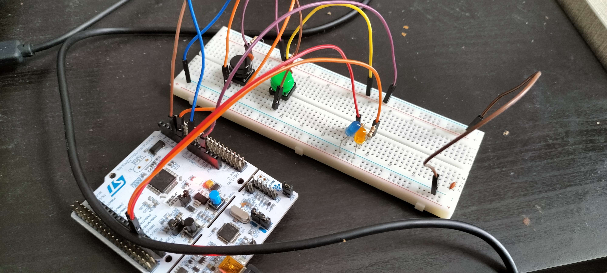
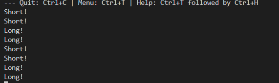

# GPIO Challenge - Nathan Thus

## Introduction

In this challenge the aim is to create a Manual Control Panel (Henceforth refered to as MCP), which uses various topics we have learnt so far in the semester. These include basic GPIO, Interrupts and rudementary Low Power Modes.

## Hardware

- STM32 Nucleo F303RE
- Ceramicc Capacitor
- Switches
- LEDs
  
## Code Design


## GPIO

GPIO is handled by the Pin class. These represent a digital version of the pin sof the nucleo, with predefined functions to set the registers correctly. They can be configured for both input & output. Additionally, they can handle interrupts and will be able to handle PWM for the next challenge.

## Interrupts

Interrupts are handled by the Pin class. Implementation of the code will be shown below.

## Low Power Modes

For the lower power side of things, the aim is to demonstrate a small difference in power draw. That satisfies the criteria, without touching on sections that are too complicated for this challenge. While you could achieve lower power modes by disabling certain timers, which throw interrupts, this is not the aim of this challenge.

```__WFI(); // This is more than enough to satisfy the criteria.```

This simply makes the processor wait for an interrupt, which is delivered by HAL_GetTick(). This also allows said function to operate, meaning I don't have to create my own timer.

By removing the IDD jumper on  the Nucleo Development board, I can measure the current draw of the board. By making a comparison between the current draw with the board running, and the current draw with the board in low power mode, I can determine the difference in power draw.

## Implementation

### Button Debouncing

One of the main problems with implementing a button, especially if it is attached to an interrupt, is signal bouncing. There are two solutions for this:

- Hardware Debouncing
- Software Debouncing

#### Software Debouncing

In software debouncing, the interrupt is triggered, and the program executes a loop, which waits for the button to be released. This is a very simple solution, but it is not very efficient. It is also not very accurate, as the time it takes to execute the loop is not accounted for.

#### Hardware Debouncing

In hardware debouncing, a capacitor is placed along the button, which is charged when the button is pressed. This capacitor is then discharged when the button is released. This is usually the prefered solution, as it provides a non-blocking approach to user input, while only requiring a capactior.

For the purposes of this challenge, and due to the requirements imposed, I'll be making use of Hardware debouncing. Below is a diagram of the circuit I used.


\pagebreak

### Circuit

Below is an image of the circuit I used for this challenge.



\pagebreak

### Detecting a button press

Here is some of the code that I used to detect a button press. This is the interrupt handler for the green button.
It starts by reading the state of the button, which then either starts a timer, or calculates the time between the press and release. This is then passed into the logic for checking if the press was long or short.

```cpp
extern "C" void EXTI1_IRQHandler(void)
{
    if(GreenButton.DigitalRead())
  {
    PrintText("Pressed!\n");
    Orange_Led.On();
    greenTimer = HAL_GetTick(); // Start Timer
  }
  else // Release
  {
    Orange_Led.Off();
    int triggerTime = HAL_GetTick();
    int actualTime = triggerTime - greenTimer;
    if(actualTime < LONG_PRESS)
    {
      PrintText("Short!\n");
    }
    else
    {
      PrintText("Long!\n");
    }
  }
  GreenButton.ResetInterrupt();
}
```

This results in the following output:



### Measuring Low Power

For measuring the low power, I used the IDD pins on the Nucleo board. These pins are used to measure the current draw of the board. By removing the jumper, I measured the current draw of the board. Below are the results:

| Mode | Current Draw (mA) |
| --- | --- |
| Default | 27.9 |
| Low Power | 14.2 |

_Measurements can be found in the evidence folder_

From this, we can conclude that ```__WFI();``` had significant impact on the power draw of the board.

While there are many ways of reducing the powerdraw further (turning off certain timers, actually implementing low power methods myself), this will suffice for the requirements of this challenge.

## Conclusion

I'll try and keep implementing hardware debounced buttons from now on, considering how easy it is, as well as the fact there's (almost) no chance of a false positive.

I had totally forgotten to enable the Rising Trigger Selection Register, which took me far longer to realise than I want to admit. I'll make sure to rework the Pin Class to designate on what it should trigger. Though I'll have to add additional functionality either way, with the next topic being PWM and timers.

Measuring the powerdraw was quite simple after Rene's explanation about the IDD pins, I was already starting to delve back into the data sheet to see which pins were for power delivery. That definely saved alotof stress.
