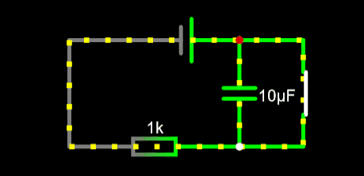

# GPIO Challenge - Nathan Thus

## Introduction

In this challenge the aim is to create a Manual Control Panel (Henceforth refered to as MCP), which uses various topics we have learnt so far in the semester. These include basic GPIO, Interrupts and rudementary Low Power Modes.

## Hardware

- STM32 Nucleo F303RE
- Ceramicc Capacitor
- Switches
- LEDs
  
## Design


## GPIO

GPIO is handled by the Pin class. These represent a digital version of the pin sof the nucleo, with predefined functions to set the registers correctly. They can be configured for both input & output. Additionally, they can handle interrupts and will be able to handle PWM for the next challenge.

## Interrupts

Interrupts are handled by the Pin class.

## Low Power Modes

For the lower power side of things, the aim is to demonstrate a small difference in power draw. That satisfies the criteria, without touching on sections that are too complicated for this challenge. While you could achieve lower power modes by disabling certain timers, which throw interrupts, this is not the aim of this challenge.

```__WFI(); // This is more than enough to satisfy the criteria.```

This simply makes the processor wait for an interrupt, which is delivered by HAL_GetTick().

## Implementation

### Button Debouncing

One of the main problems with implementing a button, especially if it is attached to an interrupt, is signal bouncing. There are two solutions for this

- Hardware Debouncing
- Software Debouncing

#### Software Debouncing

In software debouncing, the interrupt is triggered, and the program executes a loop, which waits for the button to be released. This is a very simple solution, but it is not very efficient. It is also not very accurate, as the time it takes to execute the loop is not accounted for.

#### Hardware Debouncing

In hardware debouncing, a capacitor is placed along the button, which is charged when the button is pressed. This capacitor is then discharged when the button is released. This is a much more efficient solution, as it is handled by the hardware, and is much more accurate.

For the purposes of this challenge, and due to the requirements imposed, I'll be making use of Hardware debouncing. Below is a diagram of the circuit I used.



### Detecting a button press


```cpp
extern "C" void EXTI0_IRQHandler(void)
{
  greenButton.ResetInterrupt();
  if(greenButton.DigitalRead())
  {
    greenTimer = HAL_GetTick();
  }
  else
  {
    int triggerTime = HAL_GetTick();
    if(triggerTime - greenTimer > LONG_PRESS && triggerTime - greenTimer < SHORT_PRESS)
    {
      PrintText("Long Press\n");
    }
    else
    {
      PrintText("Short Press\n");
    }
  }
}
```

### Measuring Low Power

Lorem ipsum dolor sit amet, consectetur adipiscing elit. Donec auctor, nisl eget ultricies tincidunt, nunc nisl aliquam nisl, eget aliquam nisl.

## Conclusion

Conclusion to be added at the end of the challenge.
