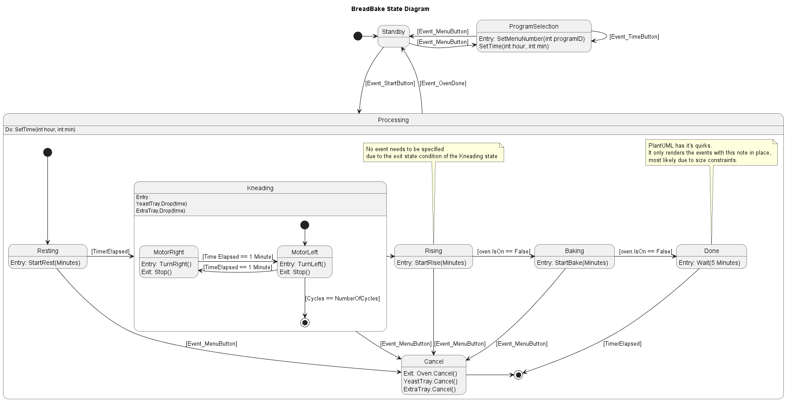

# Breadbake

Breadbake is a simplified representation of a bread baking machine.

## States

- Standby - The machine is awaiting user input.
- Baking - The machine is baking bread.
  - Kneading - The machine is kneading the dough.
  - Rising - The machine is rising the dough.
  - Resting - The machine is resting the dough.
  - Done - Machine has finished baking bread.
- Error - The machine has encountered an error.

## Managing easy state switching

Tom had a great idea for the implementation. While it is possible to create seperate states for EACH possible program, it would be easier to tell each state the time that it's allowed to take. By passing a time of -1, we could indicate that this program should not be run at all.

## Diagram

