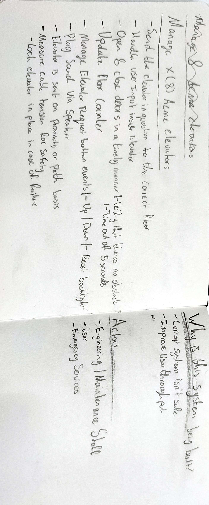
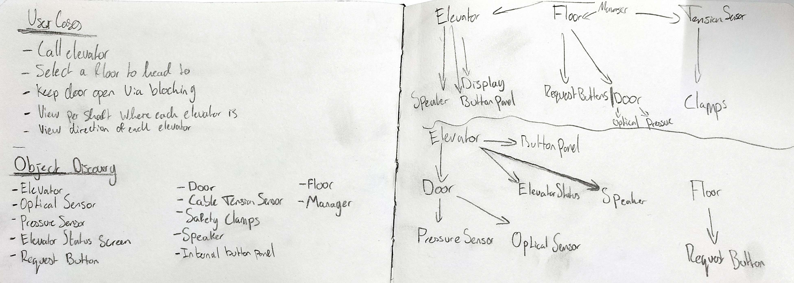

# Elevator

Elevator is a simple elevator simulator written in C++.

## Primary Function

Manage 8 ACME Elevators

## Secondary Functions

- Send the elevators to the correct floor
- Handle user input inside the elevator
- Open & close doors in a timely manner
  - Verify that there is no obstacle in the way
  - Time out after 5 seconds
- Update the floor indicator
- Manage Elevator Request Button Events
  - Up / Down
  - Reset Button Backlight
- Play sound via speaker
- Elevator is sent on proximity or path basis
- Measure cable tension for safety
  - Lock elevator in case of failure

## Why is the system being built?

The current system isn't safe. It's old and needs to be replaced. The new system will be safer and more reliable.
The system is improved by the inclusion of a new elevator control system. The new system will be able to handle more elevators and will be more reliable, alongside the cable tension measurement system.

## Actors

- User
- Engineering / Maintenance Staff
- Emergency Services

Due to the fact the latter two aren't mentioned in the document, I will refrain from making a use case diagram for them.

## Use Cases

- Call elevator
- Select floor
- Keep door open via blocking
  
## Use Case Diagram

## Class Diagram

| Class | Responsibility |
| --- | --- |
| Elevator | Combines all classes into a single usuable elevator |
| Button | Handles the pressing of a button |
| Door | Opens & Closes upon reaching a floor, as well as stopping in case of blocking |
| Floor | Controls Floor button panel & door |
| Speaker | Plays sound upon arrival at floor |
| Cable Tension Sensor | Checks & Maintains cable safety |
| Clamp | Clamps down in case of emergency |
| Proximity Sensor | Checks & relays data from proximity sensor |
| Optical Sensor | Checks & relays data from optical sensor |

Note: I prefer working with events over wierd callback functions, so I will be using events in my code. I've tried to make this clear by using the following stucture:

- Always private
- Refers to the class name
- suffixes with "Event"

This is not a requirement, but I prefer it.

## Sources

